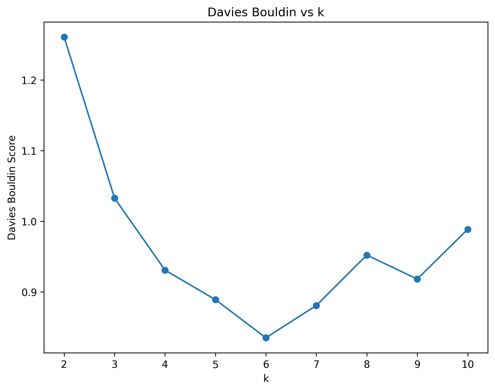
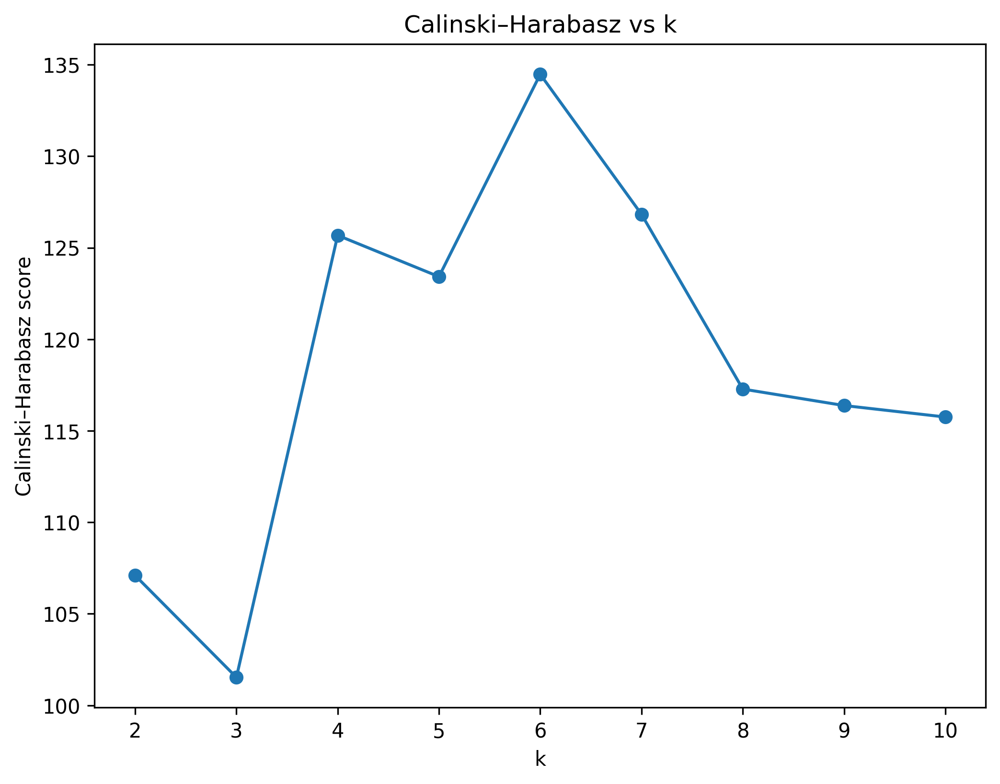
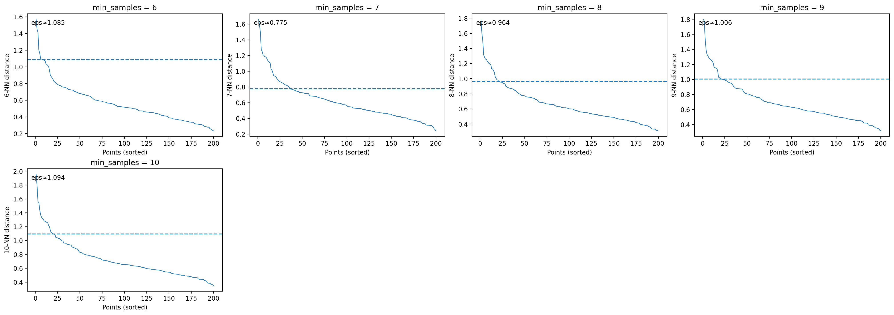
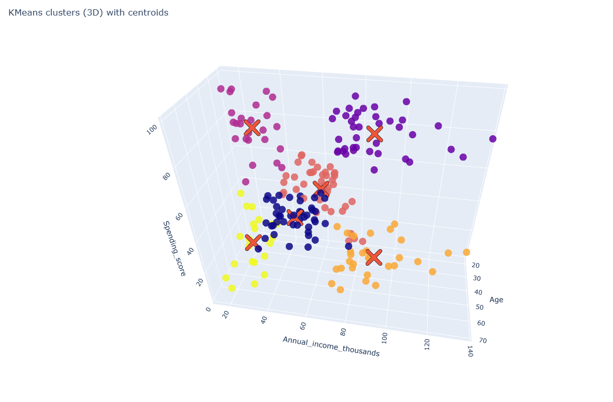
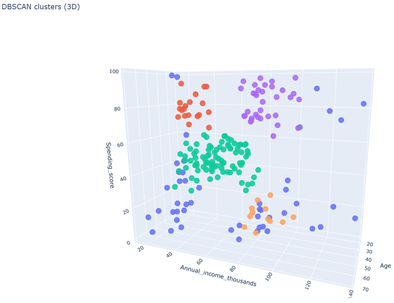
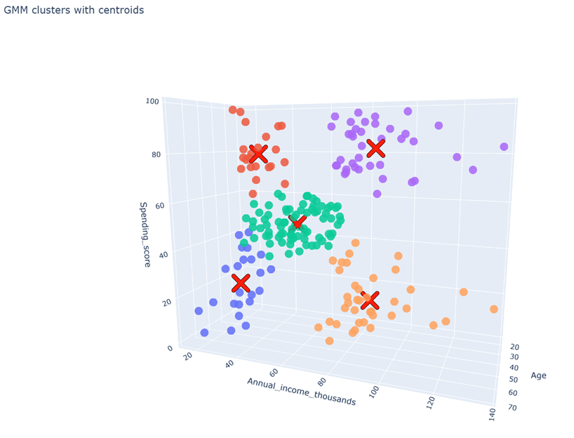

# KMeans Customer Segmentation

## Overview
The goal of this analysis is to segment the customers into groups using KMeans clustering (and other clustering methods), analyze dependencies using statistical methods to gain insights that can be used in marketing campaigns, retention efforts or pricing.

## Data
- Source: **https://www.kaggle.com/datasets/vjchoudhary7/customer-segmentation-tutorial-in-python/data**
- File: `data/raw/Mall_Customers.xlsx`
- Features columns: ``Age``, ``Income``, ``Spending score``
- Category columns: ``Gender``

> Note: Raw data is stored under `data/raw`.

## Method
1. Preprocessing
   - Load and clean data
   - Select numeric features
   - Save processed dataset
2. Explorative data analysis (EDA) & Hypothesis testing
   - Distributions
   - Pairplot & Correlation Matrix
   - PCA 2D with EVR + loadings
   - Hypothesis test (spending score dependency on age and income)
3. KMeans
   - WCSS (elbow method), Silhouette, Davies Bouldin, Calinski-Harabasz
   - KMeans on best k
   - Centroids
   - Cluster summary
   - 3D Plot
4. DBSCAN
   - Grid search for eps & min samples
   - Test and pick best config
   - Rerun DBSCAN with best config
   - 3D Plot
   - Cluster summary
5. GMM
   - Grid search for k and cov type
   - Rerun model with best config
   - 3D Plot
   - Cluster summary

## Results
### Elbow / WCSS
  
### Silhouette score
  
### Davies Bouldin

### Calinski–Harabasz

### DBSCAN eps


### 🔎 3D Cluster
➡️ **Click the thumbnail below to open the interactive plot**
[](https://dnsleu.github.io/machine_learning/projects/customer_segmentation/reports/figures/KMeans_clusters_3d.html)  
[](https://dnsleu.github.io/machine_learning/projects/customer_segmentation/reports/figures/DBSCAN_clusters_3d.html)  
[](https://dnsleu.github.io/machine_learning/projects/customer_segmentation/reports/figures/GMM_clusters_3d.html)  

Key findings:
- **The hypothesis tests have shown that spending differs across age groups, while it is relatively the same for income.**
- **Using Age, Annual income, and Spending score, each model identified distinct customer segments. Some segments were identified by all models.**  

- **KMeans**
   Older customers:  
   - moderate-income customers with moderate spending (**Cluster 0**: Age ~56, Income ~54k, Score ~49).  

   Younger customers split strongly by income and spending:  
   - high-income, high-spending group (**Cluster 1**: Age ~33, Income ~87k, Score ~82)  
   - low-income, high-spending group (**Cluster 2**: Age ~26, Income ~26k, Score ~76)  
   - mid-income, moderate-spending group (**Cluster 3**: Age ~26, Income ~59k, Score ~44)  

   Mid-Career & Pre-retirment adults:  
   - high-income, low-spending group (**Cluster 4**: Age ~44, Income ~90k, Score ~18)  
   - low-income, low-spending group (**Cluster 5**: Age ~46, Income ~26k, Score ~19)  


- **DBSCAN**
   Mid-career adults:
   - middle earners, middle spenders (**Cluster 1**: Age ~43, Income ~55k, Score ~48) 
   - high earners, low spenders  (**Cluster 3**: Age ~40, Income ~84k, Score ~15)

   Young customers:
   - low earners, high spenders (**Cluster 0**: Age ~23, Income ~26k, Score ~78)  
   - high earners, high spenders (**Cluster 2**: Age ~32, Income ~81k, Score ~82)   

- **GMM**
   Older customers:
   - low earners, low spenders (**Cluster 0**: Age ~45, Income ~26k, Score ~20)  

   Young customers:
   - low earners, high spenders (**Cluster 1**: Age ~25, Income ~25k, Score ~79)  
   - high earners, high spenders (**Cluster 2**: Age ~32, Income ~86k, Score ~82)  

   Mid-career adults:  
   - high earners, low spenders  (**Cluster 3**: Age ~40, Income ~87k, Score ~18)  
   - middle earners, middle spenders  (**Cluster 4**: Age ~43, Income ~54k, Score ~50)  

   Overall, the clusters suggest that spending score is not purely driven by income.  
   Actionable contrasts:  
   - high-income low spenders vs high-income high spenders  
   - low-income high spenders vs low-income low spenders.

## How to run
### Recreate environment
```bash
git clone https://github.com/dnsleu/machine_learning.git
python -m venv .venv
.\.venv\Scripts\Activate.ps1
pip install -r requirements.txt