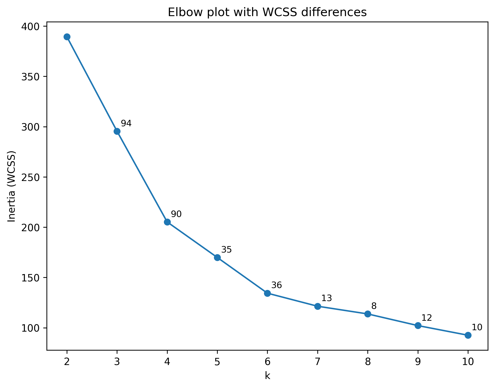
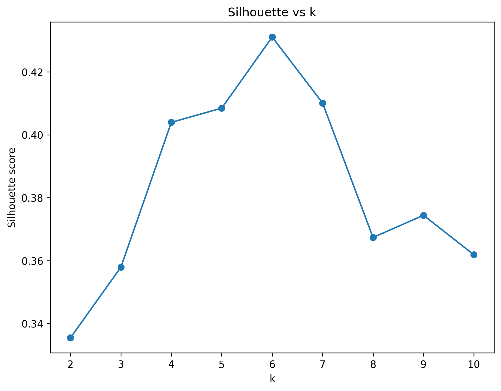

# KMeans Customer Segmentation

## Overview
The goal of this analysis is to segment the customers into groups using KMeans clustering (and other clustering methods), analyze dependencies using statistical methods to gain insights that can be used in marketing campaigns, retention efforts or pricing.

## Data
- Source: **https://www.kaggle.com/datasets/vjchoudhary7/customer-segmentation-tutorial-in-python/data**
- File: `data/raw/Mall_Customers.xlsx`
- Features columns: ``Age``, ``Income``, ``Spending score``
- Category columns: ``Gender``

> Note: Raw data is stored under `data/raw`.

## Method
1. Preprocessing
   - Load and clean data
   - Select numeric features
   - Save processed dataset
2. Explorative data analysis (EDA) & Hypothesis testing
   - Distributions
   - Pairplot
   - PCA 2D with EVR + loadings
   - Hypothesis test (spending score dependency on age and income)
3. Model selection
   - WCSS (elbow method) across k = 1..10
   - Multiple initializations (`n_init`) to reduce sensitivity to random centroid seeds
4. Training
   - Fit KMeans with chosen k
5. Visualization
   - Elbow plot with ΔWCSS annotations
   - 3D scatter of clusters + centroids
   - Optional: PCA 2D projection for interpretability

## Results
### Elbow / WCSS
  
### Silhouette score
  
### Davies Bouldin


### Cluster plot (3D)
<a href="https://dnsleu.github.io/machine_learning/projects/kmeans_customer_segmentation/reports/figures/clusters_3d.html" target="_blank" rel="noopener noreferrer">
  3D clusters plot
</a>

Key findings:
- **The hypothesis tests have shown that spending differs across age groups, while it is relatively the same for income.**
- **Using Age, Annual income, and Spending score, K-means identified six distinct customer segments with clear behavioral patterns.**  

   One segment:  
   - older, moderate-income customers with moderate spending (**Cluster 0**: Age ~56, Income ~54k, Score ~49).  

   Three segments are younger customers but split strongly by income and spending:  
   - high-income / high-spending group (**Cluster 1**: Age ~33, Income ~87k, Score ~82)  
   - low-income / high-spending group (**Cluster 2**: Age ~26, Income ~26k, Score ~76)  
   - mid-income / moderate-spending group (**Cluster 3**: Age ~26, Income ~59k, Score ~44)  

   Two segments show low spending despite very different income levels:  
   - high-income / low-spending group (**Cluster 4**: Age ~44, Income ~90k, Score ~18)  
   - low-income / low-spending group (**Cluster 5**: Age ~46, Income ~26k, Score ~19)  

   Overall, the clusters suggest that spending score is not purely driven by income.  
   Actionable contrasts:  
   - high-income low spenders vs high-income high spenders  
   - low-income high spenders vs low-income low spenders.
- **[Finding #3]**

## How to run
### Recreate environment
```bash
git clone https://github.com/dnsleu/machine_learning.git
python -m venv .venv
.\.venv\Scripts\Activate.ps1
pip install -r requirements.txt